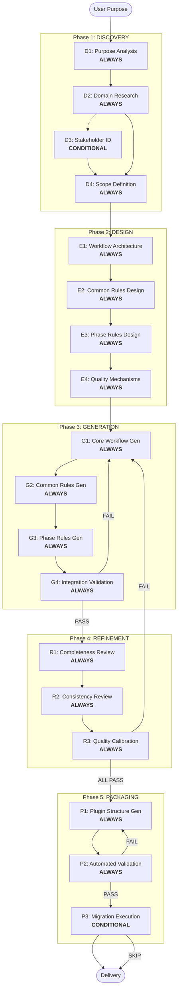

# Steering Policy Maker — Adaptive Workflow Overview

**Purpose**: Technical reference for AI model and developers to understand the complete Steering Policy Maker workflow structure.

**Note**: Similar content exists in core-workflow.md (detailed execution instructions) and welcome-message.md (user-facing introduction). This duplication is INTENTIONAL — each file serves a different purpose:
- **This file**: Concise technical reference with workflow diagram for AI model context loading
- **core-workflow.md**: Complete execution instructions with all rules and procedures
- **welcome-message.md**: User-friendly introduction displayed once at start

## The Five-Phase Lifecycle

- **DISCOVERY PHASE**: Understanding and Research (WHAT and WHY)
- **DESIGN PHASE**: Architecture and Planning (HOW to structure the policy set)
- **GENERATION PHASE**: File Creation (BUILD the steering policies)
- **REFINEMENT PHASE**: Quality Assurance (VERIFY and CALIBRATE to 15 quality dimensions)
- **PACKAGING PHASE**: Plugin Packaging (DELIVER as Claude Code skill/plugin)

## The Adaptive Workflow — 18 Stages

### Phase 1: DISCOVERY (4 stages)
- D1: Purpose Analysis (ALWAYS) — Classify target agent type and analyze core purpose
- D2: Domain Research (ALWAYS — Adaptive Depth: Minimal 3 items / Standard 7 / Comprehensive 12) — Research domain best practices, pitfalls, standards
- D3: Stakeholder Identification (CONDITIONAL — Execute IF: multiple user types) — Identify user types and interaction patterns
- D4: Scope Definition (ALWAYS) — Define boundaries, estimate size, create directory structure

### Phase 2: DESIGN (4 stages)
- E1: Workflow Architecture (ALWAYS) — Design phase/stage structure, repair judgment tree, loop control
- E2: Common Rules Design (ALWAYS) — Select and adapt cross-phase rules
- E3: Phase Rules Design (ALWAYS) — Design phase-specific rule files with domain content injection points
- E4: Quality Mechanisms Design (ALWAYS) — Design 15 quality dimensions, 3-layer testing, checkpoints

### Phase 3: GENERATION (4 stages)
- G1: Core Workflow Generation (ALWAYS — Two-Part: Planning + Generation) — Generate master orchestrator
- G2: Common Rules Generation (ALWAYS — Template-Driven: Light/Medium/Heavy) — Generate cross-phase rule files
- G3: Phase Rules Generation (ALWAYS — Domain Content Injection) — Generate phase-specific rule files
- G4: Integration Validation (ALWAYS — 3-Layer Testing) — Validate structure + content + smoke

### Phase 4: REFINEMENT (3 stages)
- R1: Completeness Review (ALWAYS — Content Depth) — Verify workflow paths + content depth
- R2: Consistency Review (ALWAYS — Domain Specificity) — Verify terminology, patterns, domain specificity rate
- R3: Quality Calibration (ALWAYS — 15 Dimensions) — Score all 15 dimensions, apply repair judgment tree

### Phase 5: PACKAGING (3 stages)
- P1: Plugin Structure Generation (ALWAYS) — Generate plugin.json, agents, skills, commands
- P2: Automated Validation (ALWAYS) — 3-layer testing (plugin version) for 4 agent types
- P3: Migration Execution (CONDITIONAL — Execute IF: existing policy brush-up) — Migrate legacy structure

## CONDITIONAL Stages

| Stage | Execute IF | Skip IF |
|-------|-----------|---------|
| D3: Stakeholder Identification | Multiple user types, cross-functional teams, role-based behavior | Single user type with unified needs |
| P3: Migration Execution | Existing legacy policy structure (e.g., `.steering/`) | New policy generation (no migration source) |

## Repair Judgment Tree (Summary)

When Quality Calibration (R3) or Completeness Review (R1) detects a FAIL or gap:

```
FAIL / Gap detected
├── Structural (file missing, reference broken, flow break) → G1
├── Content (domain specificity low, examples missing) → G3 (or G2)
├── Design (phase structure error, stage classification error) → E1
└── Criteria (dimension definition deficiency) → E4
```

**Loop Control**: Max 3 repair loops total. Same-target 2nd return triggers user escalation.

## 3-Layer Testing (Summary)

Executed at G4 (Integration Validation) and P2 (Automated Validation):

| Layer | What | Pass Criteria |
|-------|------|---------------|
| Structure | Files exist, references resolve, Markdown valid, flow paths complete | 0 errors |
| Content | Dim 12 >=40%, Dim 13 >=2/file, Dim 14 =100%, Dim 15 >=50% | All above threshold |
| Smoke | All stages reachable for 4 agent types (Process/Task/Analytical/Hybrid) | 0 blocking issues |

## Key Principles

- All phases execute for every target agent (only D3 and P3 are conditional)
- Depth adapts to domain complexity and agent type
- 15 quality dimensions ensure comprehensive quality coverage
- Repair judgment tree provides structured routing for quality failures
- Simple agents get focused treatment; complex agents get comprehensive coverage
- PACKAGING phase can be skipped entirely for policy-only workflows (no plugin needed)

## Workflow Diagram


