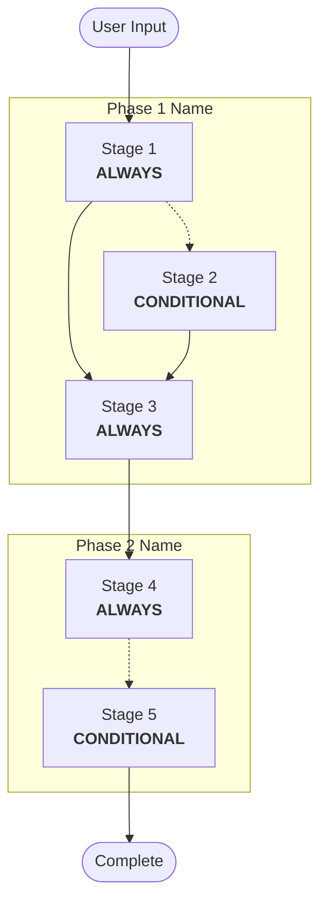

# Workflow Architecture — DESIGN Phase

## Purpose
Design the complete phase/stage structure for the target agent's workflow. This is the architectural blueprint that determines how the target agent will guide its users through the process.

## Prerequisites
- All DISCOVERY phase artifacts available and approved:
  - Purpose analysis summary (agent type, capabilities, complexity)
  - Domain research summary (best practices, standards, pitfalls)
  - Stakeholder map (if created)
  - Scope definition (boundaries, estimates, structure)
- Common rules loaded (especially `common/content-validation.md`)

## Execution Classification
**Type**: ALWAYS
This stage always executes as it establishes the fundamental workflow structure.

---

## Execution Steps

### Step 1: Load DISCOVERY Context
**Action**: Load and synthesize all DISCOVERY phase outputs
**Input**: All DISCOVERY artifacts
**Output**: Design context summary

Key context to extract:
- Agent type classification and confidence level
- Domain best practices that imply workflow steps
- Stakeholder interaction patterns
- Scope boundaries and phase/stage estimates
- Complexity level and quality target

### Step 2: Select Base Architecture Pattern
**Action**: Choose the architectural pattern based on agent type
**Input**: Agent type classification
**Output**: Base architecture selection

#### Architecture Patterns by Agent Type

**Process Agent Architecture**:
```
Phase 1: PLANNING
  → Phase 2: EXECUTION (per-unit if applicable)
    → Phase 3: VERIFICATION
      → Phase 4: DELIVERY (optional)
```
- Sequential phases with checkpoint gates
- Conditional stages within phases
- State tracking across sessions
- Complex approval flow

**Task Agent Architecture**:
```
Phase 1: SETUP / PREPARATION
  → Phase 2: EXECUTION
    → Phase 3: REPORTING
```
- Streamlined flow
- Fewer checkpoints
- Quick cycle time
- Focused output

**Analytical Agent Architecture**:
```
Phase 1: INPUT ANALYSIS
  → Phase 2: PROCESSING
    → Phase 3: OUTPUT FORMATTING
      → Phase 4: VALIDATION (optional)
```
- Data-driven flow
- Template-based stages
- Validation-heavy
- Structured outputs

**Hybrid Agent Architecture**:
```
Phase 0: CONTEXT ASSESSMENT (determines mode)
  → [Mode A Path]: Phase A1 → Phase A2 → ...
  → [Mode B Path]: Phase B1 → Phase B2 → ...
  → Phase N: SYNTHESIS (merges mode outputs)
```
- Mode detection stage
- Multiple operational paths
- Context-dependent branching
- Complex state management

### Step 3: Design Phase Structure
**Action**: Define the specific phases for the target agent
**Input**: Base architecture + scope definition
**Output**: Phase structure document

For each phase, define:
1. **Phase Name**: Clear, descriptive name
2. **Purpose Statement**: What this phase achieves
3. **Focus Area**: Key focus (e.g., "Determine WHAT to review and HOW")
4. **Entry Criteria**: What must be true to enter this phase
5. **Exit Criteria**: What must be true to leave this phase
6. **Approximate Stage Count**: Expected number of stages

### Step 4: Design Stage Structure
**Action**: Define all stages within each phase
**Input**: Phase structure + domain best practices
**Output**: Complete stage inventory

For each stage, define:
1. **Stage Name**: Clear, action-oriented name
2. **Execution Classification**: ALWAYS or CONDITIONAL
3. **For CONDITIONAL stages**:
   - Execute IF criteria (explicit conditions)
   - Skip IF criteria (explicit conditions)
4. **Purpose**: What this stage achieves
5. **Key Actions**: High-level list of what the stage does
6. **Inputs**: What data/context the stage needs
7. **Outputs**: What artifacts the stage produces
8. **Approval Gate**: Whether user approval is needed before proceeding
9. **Adaptive Depth**: Whether the stage supports multiple depth levels

### Step 5: Design Stage Dependencies
**Action**: Map dependencies between stages
**Input**: Complete stage inventory
**Output**: Dependency graph

Rules for dependency design:
- No circular dependencies
- Minimize cross-phase dependencies (prefer forward-only)
- Identify which stages can run in parallel (if applicable)
- Identify which stages must be sequential
- Document optional vs required dependencies

### Step 6: Design Checkpoint Placement
**Action**: Determine where approval gates are needed
**Input**: Stage inventory + risk assessment
**Output**: Checkpoint map

#### Checkpoint Placement Rules

**ALWAYS place checkpoints**:
- Between phases (phase transition gates)
- After stages that produce key decisions
- After stages that create significant artifacts
- Before stages that generate irreversible outputs

**OPTIONALLY place checkpoints**:
- Between related stages within a phase
- After low-risk, automated stages
- Between parallel execution branches

### Step 7: Design State Tracking
**Action**: Design how the target agent tracks progress
**Input**: Phase/stage structure
**Output**: State tracking design

State file should track:
- Current phase and stage
- Completion status of each stage (PENDING/IN PROGRESS/COMPLETED/SKIPPED)
- Key decisions made
- Timestamps for all state changes
- Dependencies satisfied

### Step 8: Create Workflow Visualization
**Action**: Create visual representation of the workflow
**Input**: Phase/stage structure + dependencies
**Output**: Workflow diagram

**MANDATORY**: Validate Mermaid syntax before writing (per `common/content-validation.md`)
**MANDATORY**: Include text alternative alongside diagram

#### Mermaid Diagram Template



### Step 9: Generate Architecture Questions (If Needed)
**Action**: Create questions about architectural decisions
**Input**: All design work with decision points
**Output**: Architecture question file

Create `steering-docs/<agent-name>/design/workflow-architecture-questions.md` if:
- Multiple valid phase structures exist
- Stage classification (ALWAYS vs CONDITIONAL) is debatable
- Checkpoint placement has trade-offs
- Stakeholder interaction patterns suggest alternatives
- Domain best practices support multiple approaches

### Step 10: Present Workflow Architecture
**Action**: Present complete architecture for approval
**Input**: All design outputs + visualization
**Output**: Formatted architecture presentation

---

## Output Artifacts

### Workflow Architecture Document
- **File**: `steering-docs/<agent-name>/design/workflow-architecture.md`
- **Content**: Complete workflow design with phases, stages, dependencies, checkpoints
- **Format**:

```markdown
# Workflow Architecture

## Architecture Overview
- **Agent Type**: [type]
- **Base Pattern**: [pattern name]
- **Total Phases**: [N]
- **Total Stages**: [N] (ALWAYS: [N], CONDITIONAL: [N])
- **Checkpoints**: [N]

## Workflow Visualization
[Mermaid diagram]
[Text alternative]

## Phase Definitions

### Phase 1: [Name]
**Purpose**: [What this phase achieves]
**Focus**: [Key focus area]
**Entry Criteria**: [What must be true]
**Exit Criteria**: [What must be true]

#### Stages:
| Stage | Classification | Purpose | Approval Gate |
|-------|---------------|---------|---------------|
| [Name] | ALWAYS | [Purpose] | Yes/No |
| [Name] | CONDITIONAL | [Purpose] | Yes/No |

[Continue for all phases]

## Stage Dependency Map
[Dependency diagram or table]

## Checkpoint Map
| Checkpoint | Location | Purpose |
|------------|----------|---------|
| CP-1 | After [stage] | [Purpose] |

## State Tracking Design
[State file format for the target agent]
```

---

## Completion Message

### REVIEW REQUIRED

**Workflow Architecture is complete.** Here's a summary:

- **Architecture Pattern**: [pattern name] based on [agent type] classification
- **Phases**: [N] phases designed
- **Stages**: [N] total ([N] ALWAYS, [N] CONDITIONAL)
- **Checkpoints**: [N] approval gates
- **Visualization**: [Included/See document]

Key design decisions:
- [Decision 1]
- [Decision 2]

### WHAT'S NEXT

Please choose one of the following:

**A) Request Changes** — I'll revise the workflow architecture based on your feedback
**B) Continue to Common Rules Design** — Proceed to select and adapt common rules

---

## Repair Judgment Tree Design Guide

When designing the workflow architecture, include a repair judgment tree that maps quality dimension FAILs to return targets:

1. **Classify problem types**: structural, content, design, criteria
2. **Map each quality dimension** to a problem type and return-to stage
3. **Define loop control**: max retries (recommended: 3), same-target limit (recommended: 2), escalation conditions
4. **Design PACKAGING extension** (for Complex agents): include P1→P2 loop with separate counter (max 2)

### Repair Loop Control Design Template

| Rule | Recommended Value | Rationale |
|------|------------------|-----------|
| Max retries (total) | 3 | Prevents session length explosion |
| Same-target limit | 2 | Signals wrong problem classification |
| Escalation options | Continue / Abort / Rescope | Gives user control |
| P2→P1 loop | Max 2 (separate counter) | Plugin-specific fixes are bounded |

---

## Error Handling

### Architecture Pattern Mismatch
- **Issue**: No standard pattern fits the target agent well
- **Solution**: Design custom architecture using elements from multiple patterns
- **Recovery**: Present custom design with clear rationale

### Too Many Stages
- **Issue**: Stage count exceeds practical limits for the target agent
- **Solution**: Merge related stages, convert some to sub-steps within stages
- **Workaround**: Create a phased approach where advanced stages are optional

### Circular Dependencies
- **Issue**: Stages depend on each other in a cycle
- **Solution**: Restructure stages to break the cycle, possibly merge stages
- **Recovery**: Introduce intermediate stages or restructure phase boundaries

### Conflicting Stakeholder Workflows
- **Issue**: Different stakeholders need different workflow paths
- **Solution**: Design role-based branching or separate workflow tracks
- **Recovery**: Simplify to common path with optional role-specific stages

## References
- `discovery/purpose-analysis.md` — Agent type and capabilities
- `discovery/domain-research.md` — Domain workflow patterns
- `discovery/scope-definition.md` — Scope boundaries and estimates
- `common/content-validation.md` — Diagram validation rules
- `common/output-structure-patterns.md` — Structural patterns
