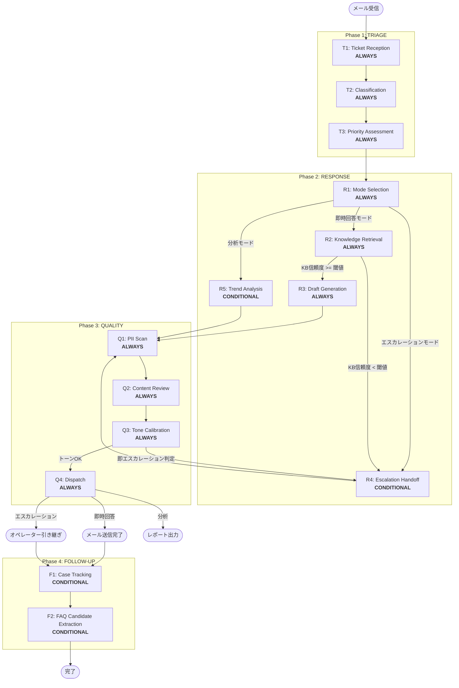

# Workflow Architecture (v2 — Red Team指摘反映)

## Architecture Overview
- **Agent Type**: Hybrid Agent
- **Base Pattern**: Context Assessment → Mode-Specific Processing → Quality Gate
- **Operational Phases**: 3 (TRIAGE, RESPONSE, QUALITY) + Post-Response: FOLLOW-UP
- **Build-Time Phase**: PACKAGING (P1, P2)
- **Operational Stages**: 14 (ALWAYS: 11, CONDITIONAL: 3)
- **Build-Time Stages**: 2
- **Checkpoints**: 7

## Changes from v1
- **C1 fix**: エスカレーション/分析パスにも PII Scan (Q1) を適用する分岐を追加
- **C2 fix**: FOLLOW-UP フェーズを追加（エスカレーション追跡 + FAQ候補抽出）
- **C3 fix**: R1 に感情ベースのエスカレーション条件を追加。Q3→R1 リペアパス設計
- **M2 fix**: PACKAGING を「ビルドタイムフロー」として明確に分離
- **M3 fix**: SLA超過時の短縮パスを追加
- **M4 fix**: R2 に KB信頼度スコア閾値を追加、閾値以下でエスカレーション切り替え

## Workflow Visualization



### Text Alternative
```
Phase 1: TRIAGE
  T1: Ticket Reception (ALWAYS) → T2: Classification (ALWAYS) → T3: Priority Assessment (ALWAYS)

Phase 2: RESPONSE
  R1: Mode Selection (ALWAYS)
    ├─ 即時回答モード → R2: Knowledge Retrieval (ALWAYS)
    │   ├─ KB信頼度 >= 閾値 → R3: Draft Generation (ALWAYS) → Phase 3
    │   └─ KB信頼度 < 閾値 → R4: Escalation Handoff → Phase 3
    ├─ エスカレーションモード → R4: Escalation Handoff (CONDITIONAL) → Phase 3
    └─ 分析モード → R5: Trend Analysis (CONDITIONAL) → Phase 3

Phase 3: QUALITY（全モード共通 — C1 fix）
  Q1: PII Scan (ALWAYS) → Q2: Content Review (ALWAYS) → Q3: Tone Calibration (ALWAYS)
    ├─ トーンOK → Q4: Dispatch (ALWAYS) → 各モードの出力先
    └─ 即エスカレーション判定 → R4 に戻る（C3 fix: リペアパス）

Phase 4: FOLLOW-UP（C2 fix）
  F1: Case Tracking (CONDITIONAL) — エスカレーション/保留/顧客返信待ち
  F2: FAQ Candidate Extraction (CONDITIONAL) — 同カテゴリ問い合わせ閾値超過時

Build-Time: PACKAGING（M2 fix: 運用フローとは独立）
  P1: Plugin Structure Generation (ALWAYS)
  P2: Automated Validation (ALWAYS)
```

## Phase Definitions

### Phase 1: TRIAGE（トリアージ）
**Purpose**: 受信メールを解析し、分類・優先度付けを行う
**Focus**: 問い合わせの正確な理解と分類
**Entry Criteria**: メール問い合わせが受信されている
**Exit Criteria**: カテゴリ・優先度・SLA残時間が確定

#### Stages:
| Stage | Classification | Purpose | Approval Gate |
|-------|---------------|---------|---------------|
| T1: Ticket Reception | ALWAYS | メール解析、顧客情報抽出、PII初期検出・フラグ付与、チケット生成 | No |
| T2: Classification | ALWAYS | カテゴリ判定（アカウント/課金/機能/バグ/セキュリティ） | No |
| T3: Priority Assessment | ALWAYS | 優先度スコアリング、SLA算出、SLA超過警告 | Yes（CP-1） |

### Phase 2: RESPONSE（対応）
**Purpose**: トリアージ結果に基づき、最適なモードで対応を実行
**Focus**: モード判定と各モードでの的確な処理実行
**Entry Criteria**: Phase 1 のトリアージが完了
**Exit Criteria**: 各モードの出力（回答ドラフト/引き継ぎサマリー/レポート）が生成されている

#### Stages:
| Stage | Classification | Purpose | Approval Gate |
|-------|---------------|---------|---------------|
| R1: Mode Selection | ALWAYS | エスカレーション条件チェック（条件ベース + 感情ベース）→ モード判定 | No |
| R2: Knowledge Retrieval | ALWAYS | KB検索、関連記事取得、KB信頼度スコア算出 | No |
| R3: Draft Generation | ALWAYS | 回答ドラフト生成（KB引用+パーソナライズ） | Yes（CP-2） |
| R4: Escalation Handoff | CONDITIONAL | コンテキストサマリー生成、中間応答ドラフト作成 | Yes（CP-3） |
| R5: Trend Analysis | CONDITIONAL | 問い合わせ傾向の集計・レポート生成 | Yes（CP-4） |

**R1 エスカレーション条件（v2 — C3 fix: 感情ベース追加）**:
- 条件ベース: セキュリティインシデント / データ損失リスク / 法的問題 / 顧客の明示的要求 / 3往復以上未解決（同一チケット内 or チケット横断で同カテゴリ3件以上）
- **感情ベース（NEW）**: 怒りシグナル検出 × クレーム対応中セグメント → 即エスカレーション
- セキュリティインシデント固有SLA: プラン問わず1h FRT

**R2 KB信頼度スコア閾値（v2 — M4 fix）**:
- KB検索結果の最高関連度スコアが閾値（0.6）未満の場合、即時回答モードからエスカレーションモードに切り替え
- 「確認の上回答」テンプレートは信頼度 0.4-0.6 の場合のみ使用
- 信頼度 < 0.4 は即エスカレーション

**R4/R5 共通変更（v2 — C1 fix）**:
- R4/R5 の出力はすべて Phase 3 QUALITY（Q1→Q2→Q3→Q4）を通過する
- R4: 中間応答メール + 引き継ぎサマリーの両方がPII Scan対象
- R5: 分析レポートがPII Scan対象

### Phase 3: QUALITY（品質検査）
**Purpose**: 全モードの出力に対し多段階品質検証を実施（v2: 全モード共通化）
**Focus**: PII保護、正確性、トーン適合性の担保
**Entry Criteria**: Phase 2 のいずれかのモードで出力が生成されている
**Exit Criteria**: 全品質チェックをパスし、出力可能状態

#### Stages:
| Stage | Classification | Purpose | Approval Gate |
|-------|---------------|---------|---------------|
| Q1: PII Scan | ALWAYS | PII検出・自動マスキング（全モード共通） | No |
| Q2: Content Review | ALWAYS | 正確性検証、禁止表現チェック | No |
| Q3: Tone Calibration | ALWAYS | トーン適合性チェック。即エスカレーション判定時はR4へリペアパス | No |
| Q4: Dispatch | ALWAYS | 最終確認、送信/引き継ぎ/レポート出力、監査ログ記録 | Yes（CP-5） |

**Q3 リペアパス（v2 — C3 fix）**:
- トーンマトリクスで「即エスカレーション」判定が出た場合:
  1. 現在のモードが即時回答 → R4（Escalation Handoff）に遷移
  2. R4 の出力は再び Q1 から品質検査を通過
  3. リペアは最大1回（2回目の即エスカレーション判定は強制エスカレーション）

**SLA超過時の短縮パス（v2 — M3 fix）**:
- SLA残時間 < 15分の場合: Q2(Content Review)を簡易チェックに短縮、Q3(Tone)は省略不可
- SLA超過後: 即座にQ4へ進み、SLA超過フラグ付きで送信。管理者に自動通知
- **PII Scan (Q1) はSLA状態に関わらず必ず実行**（省略不可）

### Phase 4: FOLLOW-UP（フォローアップ — v2新設）
**Purpose**: 対応完了後の追跡とナレッジ改善
**Focus**: 未解決案件の追跡、FAQ候補抽出、CSAT収集

#### Stages:
| Stage | Classification | Purpose | Approval Gate |
|-------|---------------|---------|---------------|
| F1: Case Tracking | CONDITIONAL | 未解決案件の追跡、SLA再監視、クローズ条件チェック | Yes（CP-6） |
| F2: FAQ Candidate Extraction | CONDITIONAL | 重複問い合わせクラスタリング、KB改善候補抽出 | Yes（CP-7） |

**F1 Execute IF**: エスカレーション済み / 保留回答（「確認の上回答」送信後） / 顧客返信待ち
**F1 Skip IF**: 即時回答で解決済み（顧客からの追加連絡なし）

**F2 Execute IF**: 同カテゴリ問い合わせが期間内閾値超過 / CSAT低評価チケット蓄積
**F2 Skip IF**: 通常運用範囲内

### Build-Time: PACKAGING（ビルドタイムフロー — 運用フローとは独立）
**Purpose**: 検証済みポリシーをClaude Codeプラグイン形式にパッケージング
**Note**: このフェーズはポリシー初期構築/更新時のみ実行。チケット処理のランタイムフローには含まれない。

| Stage | Classification | Purpose | Approval Gate |
|-------|---------------|---------|---------------|
| P1: Plugin Structure Generation | ALWAYS | plugin.json, agents, skills, commands生成 | Yes（CP-8） |
| P2: Automated Validation | ALWAYS | 3層テスト（構造+コンテンツ+スモーク） | Yes |

## Stage Dependency Map

| Stage | Depends On | Produces |
|-------|-----------|----------|
| T1 | メール入力 | チケットオブジェクト、顧客情報、PIIフラグ |
| T2 | T1 | カテゴリ、サブカテゴリ |
| T3 | T1, T2 | 優先度スコア、SLA残時間、SLA超過警告 |
| R1 | T2, T3, T1(感情シグナル) | モード判定結果 |
| R2 | R1 (即時回答モード) | KB検索結果、KB信頼度スコア |
| R3 | R2 (信頼度>=閾値), T1 | 回答ドラフト |
| R4 | R1 (エスカレーション) or R2 (信頼度<閾値) or Q3 (リペアパス) | 引き継ぎサマリー、中間応答ドラフト |
| R5 | R1 (分析モード) | 傾向レポートドラフト |
| Q1 | R3 or R4 or R5 | PIIマスキング済み出力 |
| Q2 | Q1 | 正確性検証済み出力 |
| Q3 | Q2, T1 (セグメント+感情) | トーン調整済み出力 or エスカレーション判定 |
| Q4 | Q3 | 送信済み/引き継ぎ済み/レポート出力、監査ログ |
| F1 | Q4 (エスカレーション/保留) | 追跡記録、クローズ判定 |
| F2 | F1 or 閾値トリガー | FAQ候補リスト、KB改善提案 |

## Checkpoint Map

| CP | Location | Purpose |
|----|----------|---------|
| CP-1 | After T3 | トリアージ結果確認 |
| CP-2 | After R3 | 回答ドラフトレビュー |
| CP-3 | After R4 | エスカレーション内容確認 |
| CP-4 | After R5 | 分析レポートレビュー |
| CP-5 | Before Q4 | 送信前最終確認（v2: Q4の前に移動） |
| CP-6 | After F1 | フォローアップ状況確認 |
| CP-7 | After F2 | FAQ候補・KB改善提案確認 |
| CP-8 | After P1 | プラグイン構造確認 |

## Repair Judgment Tree

```
FAIL / Gap detected
├── Structural (ファイル欠損, 参照切れ, フローブレーク)
│   → core-workflow再生成
├── Content (ドメイン特化率低, 例不足, テンプレート不足)
│   → Phase Rules再生成 or Common Rules再生成
├── Design (フェーズ構造不適, ステージ分類誤り)
│   → Workflow Architecture再設計
└── Criteria (品質次元定義不備)
    → Quality Mechanisms再設計
```

### Loop Control
| Rule | Value |
|------|-------|
| Max retries (total) | 3 |
| Same-target limit | 2 |
| Escalation options | Continue / Abort / Rescope |
| P2→P1 loop | Max 2 (separate counter) |
| Q3→R4 repair | Max 1 (2回目は強制エスカレーション) |

## State Tracking Design

```markdown
# Customer Support Agent — State

## Current Ticket
- **Ticket ID**: [ID]
- **Customer**: [name] / [segment: VIP/General/Complaint]
- **Category**: [category/subcategory]
- **Priority**: [P1-P4] / SLA: [remaining time] / SLA Status: [OK/Warning/Exceeded]
- **Mode**: [immediate/escalation/analysis]
- **Phase**: [TRIAGE/RESPONSE/QUALITY/FOLLOW-UP]
- **Stage**: [current stage]
- **PII Flags**: [detected PII types from T1]
- **Emotion Signal**: [normal/confused/frustrated/angry]
- **KB Confidence**: [score from R2]

## Processing History
- [timestamp] T1: Ticket received — [customer email], PII flags: [types]
- [timestamp] T2: Classified — [category], confidence: [score]
- [timestamp] T3: Priority — [P-level], SLA — [time]
- [timestamp] R1: Mode — [mode], reason: [condition matched]
- [timestamp] Q3: Tone — [result], repair: [none/escalation]
- [timestamp] Q4: Dispatched — SLA: [met/exceeded]
- [timestamp] F1: Follow-up — [status]

## CSAT
- **Score**: [1-5 or pending]
- **Feedback**: [text if provided]
```
