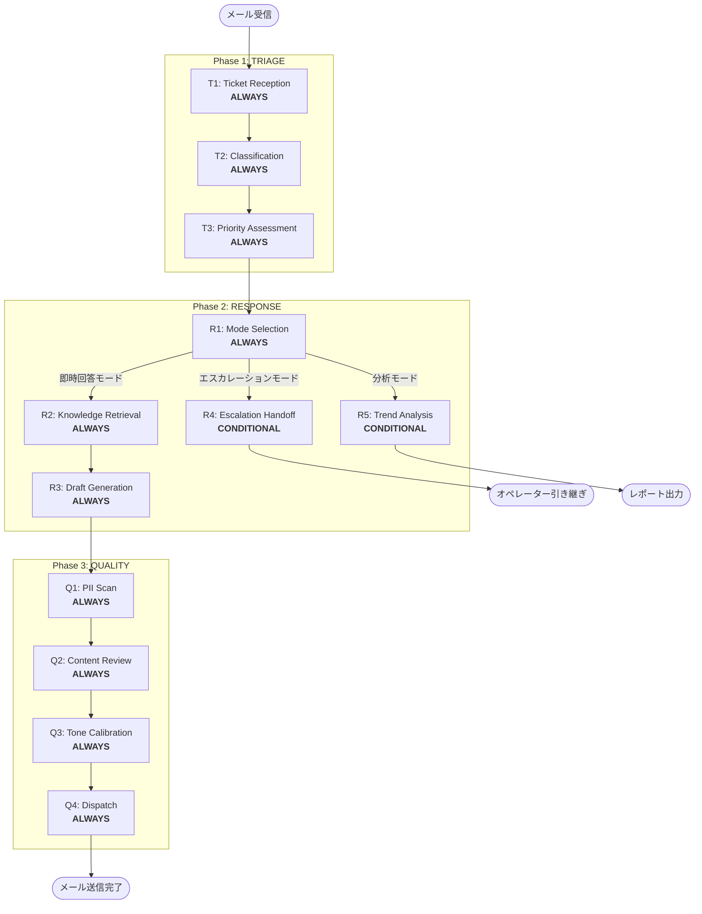

# Workflow Architecture

## Architecture Overview
- **Agent Type**: Hybrid Agent
- **Base Pattern**: Context Assessment → Mode-Specific Processing → Quality Gate
- **Total Phases**: 4 (TRIAGE, RESPONSE, QUALITY, PACKAGING)
- **Total Stages**: 12 (ALWAYS: 10, CONDITIONAL: 2)
- **Checkpoints**: 6 (phase transitions + key decision points)

## Workflow Visualization



### Text Alternative
```
Phase 1: TRIAGE
  T1: Ticket Reception (ALWAYS) → T2: Classification (ALWAYS) → T3: Priority Assessment (ALWAYS)

Phase 2: RESPONSE
  R1: Mode Selection (ALWAYS)
    ├─ 即時回答モード → R2: Knowledge Retrieval (ALWAYS) → R3: Draft Generation (ALWAYS) → Phase 3
    ├─ エスカレーションモード → R4: Escalation Handoff (CONDITIONAL) → オペレーター引き継ぎ
    └─ 分析モード → R5: Trend Analysis (CONDITIONAL) → レポート出力

Phase 3: QUALITY
  Q1: PII Scan (ALWAYS) → Q2: Content Review (ALWAYS) → Q3: Tone Calibration (ALWAYS) → Q4: Dispatch (ALWAYS)
```

## Phase Definitions

### Phase 1: TRIAGE（トリアージ）
**Purpose**: 受信メールを解析し、分類・優先度付けを行い、適切な処理モードへルーティングする
**Focus**: 問い合わせの正確な理解と分類
**Entry Criteria**: メール問い合わせが受信されている
**Exit Criteria**: カテゴリ・優先度・SLA残時間が確定し、Phase 2 への入力が整っている

#### Stages:
| Stage | Classification | Purpose | Approval Gate |
|-------|---------------|---------|---------------|
| T1: Ticket Reception | ALWAYS | メール解析、顧客情報抽出、チケット生成 | No |
| T2: Classification | ALWAYS | カテゴリ判定（アカウント/課金/機能/バグ/セキュリティ） | No |
| T3: Priority Assessment | ALWAYS | 顧客プラン・SLA・緊急度に基づく優先度スコアリング | Yes（CP-1） |

### Phase 2: RESPONSE（対応）
**Purpose**: トリアージ結果に基づき、最適なモード（即時回答/エスカレーション/分析）で対応を実行する
**Focus**: モード判定と各モードでの的確な処理実行
**Entry Criteria**: Phase 1 のトリアージが完了し、カテゴリ・優先度が確定している
**Exit Criteria**: 回答ドラフトが生成されている、またはエスカレーション/分析が完了している

#### Stages:
| Stage | Classification | Purpose | Approval Gate |
|-------|---------------|---------|---------------|
| R1: Mode Selection | ALWAYS | エスカレーション条件チェック → モード判定 | No |
| R2: Knowledge Retrieval | ALWAYS | KB検索、関連記事・過去事例の取得 | No |
| R3: Draft Generation | ALWAYS | 回答ドラフト生成（KB引用+パーソナライズ） | Yes（CP-2） |
| R4: Escalation Handoff | CONDITIONAL | コンテキストサマリー生成、オペレーターへの引き継ぎ | Yes（CP-3） |
| R5: Trend Analysis | CONDITIONAL | 問い合わせ傾向の集計・レポート生成 | Yes（CP-4） |

**R4 Execute IF**: セキュリティインシデント / データ損失リスク / 法的問題 / 顧客の明示的要求 / 3往復以上未解決
**R4 Skip IF**: 上記条件に該当しない

**R5 Execute IF**: 管理者が分析モードをリクエスト / 定期レポートタイミング
**R5 Skip IF**: 通常の問い合わせ対応フロー

### Phase 3: QUALITY（品質検査）
**Purpose**: 送信前に回答の品質・コンプライアンスを多段階で検証する
**Focus**: PII保護、正確性、トーン適合性の担保
**Entry Criteria**: Phase 2 で回答ドラフトが生成されている（即時回答モードのみ）
**Exit Criteria**: 全品質チェックをパスし、送信可能状態になっている

#### Stages:
| Stage | Classification | Purpose | Approval Gate |
|-------|---------------|---------|---------------|
| Q1: PII Scan | ALWAYS | PII検出・自動マスキング | No |
| Q2: Content Review | ALWAYS | KB照合による正確性検証、禁止表現チェック | No |
| Q3: Tone Calibration | ALWAYS | セグメント×感情に基づくトーン適合性チェック | No |
| Q4: Dispatch | ALWAYS | 最終確認、送信、監査ログ記録 | Yes（CP-5） |

### Phase 4: PACKAGING
**Purpose**: 検証済みポリシーをClaude Codeプラグイン形式にパッケージング
**Focus**: プラグイン構造生成と自動バリデーション

#### Stages:
| Stage | Classification | Purpose | Approval Gate |
|-------|---------------|---------|---------------|
| P1: Plugin Structure Generation | ALWAYS | plugin.json, agents, skills, commands生成 | Yes（CP-6） |
| P2: Automated Validation | ALWAYS | 3層テスト（構造+コンテンツ+スモーク） | Yes |

## Stage Dependency Map

| Stage | Depends On | Produces |
|-------|-----------|----------|
| T1 | メール入力 | チケットオブジェクト、顧客情報 |
| T2 | T1 | カテゴリ、サブカテゴリ |
| T3 | T1, T2 | 優先度スコア、SLA残時間 |
| R1 | T2, T3 | モード判定結果 |
| R2 | R1 (即時回答モード) | KB検索結果、関連記事リスト |
| R3 | R2, T1 | 回答ドラフト |
| R4 | R1 (エスカレーションモード) | 引き継ぎサマリー |
| R5 | R1 (分析モード) | 傾向レポート |
| Q1 | R3 | PIIマスキング済み回答 |
| Q2 | Q1 | 正確性検証済み回答 |
| Q3 | Q2, T1 (顧客セグメント) | トーン調整済み回答 |
| Q4 | Q3 | 送信済みメール、監査ログ |

## Checkpoint Map

| Checkpoint | Location | Purpose |
|------------|----------|---------|
| CP-1 | After T3 (Priority Assessment) | トリアージ結果の確認、モード判定前の承認 |
| CP-2 | After R3 (Draft Generation) | 回答ドラフトの品質確認 |
| CP-3 | After R4 (Escalation Handoff) | エスカレーション内容の確認 |
| CP-4 | After R5 (Trend Analysis) | 分析レポートの確認 |
| CP-5 | After Q4 (Dispatch) | 送信前最終確認 |
| CP-6 | After P1 (Plugin Structure) | プラグイン構造の確認 |

## Repair Judgment Tree

```
FAIL / Gap detected
├── Structural (ファイル欠損, 参照切れ, フローブレーク)
│   → core-workflow再生成
├── Content (ドメイン特化率低, 例不足, テンプレート不足)
│   → Phase Rules再生成 or Common Rules再生成
├── Design (フェーズ構造不適, ステージ分類誤り)
│   → Workflow Architecture再設計
└── Criteria (品質次元定義不備)
    → Quality Mechanisms再設計
```

### Loop Control
| Rule | Value |
|------|-------|
| Max retries (total) | 3 |
| Same-target limit | 2 (2回目でユーザーエスカレーション) |
| Escalation options | Continue / Abort / Rescope |
| P2→P1 loop | Max 2 (separate counter) |

## State Tracking Design

```markdown
# Customer Support Agent — State

## Current Ticket
- **Ticket ID**: [ID]
- **Customer**: [name] / [segment: VIP/General/Complaint]
- **Category**: [category/subcategory]
- **Priority**: [score] / SLA: [remaining time]
- **Mode**: [immediate/escalation/analysis]
- **Phase**: [TRIAGE/RESPONSE/QUALITY]
- **Stage**: [current stage]

## Processing History
- [timestamp] T1: Ticket received — [customer email]
- [timestamp] T2: Classified — [category]
- [timestamp] T3: Priority — [score], SLA — [time]
- [timestamp] R1: Mode — [mode]
```
